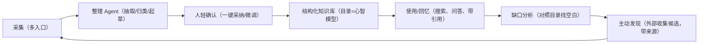

# 知林 Grove — 个人知识管家产品提案

> 状态：探索共识文档（v0.2，2026-08-12）
> 用途：新项目立项前的地基文档，只记录产品思考与决策，不含实现

## 1. 一句话定位

把散落在各处的经验与知识（收藏、截图、文档、链接），在人与 AI 的共创下，沉淀为属于用户自己的结构化知识库；并逐步具备回忆与主动发现的能力，成为一个陪伴用户成长的「个人知识管家」。

## 2. 背景与用户问题

- **问题一：收藏吃灰。** 用户在很多软件上收藏、截图，信息零散不成体系，想不起来也查不方便；让人一点点整理会很难受，容易一开始就放弃。
- **问题二：目录即心智。** 与 AI 共创目录后，用户会看见项目的全貌与缺口，从而产生「还需要去发现更多东西」的需求；希望 AI 能主动发现、帮助缩短这个过程。

理想体验：用户丢一系列素材过来（文字/截图/文档/链接，视频后置），AI 处理提取整理好，让人确认；在人与 AI 的共创下，得到符合每个人理解方式与所处阶段的知识库。

## 3. 产品定义与核心飞轮

产品不是「AI 整理工具」，而是「个人知识管家」：它知道你有什么、不知道什么，帮你把散落的信息变成体系，还会主动告诉你缺什么、去哪补。

设计原则：

1. **目录是人与 AI 共创的心智模型**，是产品的控制平面。
2. **AI 永远产出候选，人拥有最终决定权**，信任是产品的根基。
3. **确认负担趋近于零**：批量采纳、逐条划掉，不做「一条条填表」。
4. **个性化通过目录与确认行为隐式学习**：确认/拒绝/修改都是训练信号。
5. **主动发现要有边界感**：节奏由用户控制（如每周缺口报告），不是随时打扰。

## 4. 产品形态

- **采集为主，多入口贴近用户。** Web 阶段：拖拽/粘贴/上传/链接；移动原生阶段：分享面板、系统截图直采。
- **对话式 Agent 是共创与答疑界面**，可接收素材，但不是采集主通道；对话 UI 的技术候选是 CopilotKit（见第 9 节）。
- **平台：Web 优先**；移动端做原生 App（不沿用响应式 Web 方案）。

## 5. MVP 范围（v1）

### 包含

- **账号登录**：账号 + 密码，会话 Cookie；数据从一开始按 Workspace 隔离（为未来推广做准备，推广期再扩展邮箱/手机号/第三方登录）
- 项目 + 目录树（装修场景起步目录模板）
- 采集：拖拽/粘贴/上传/链接正文
- 异步处理管道：OCR（云端多模态模型）→ AI 抽取 → 候选
- 候选确认：批量采纳 / 逐条编辑 / 拒绝
- 正式记录 + 来源追溯 + 搜索
- AI 全部云端 API（文本模型 + 视觉模型供应商），Provider 抽象可换
- 第一个场景：装修，自己当用户验证

### 不包含（v1）

- 本地模型模式
- 移动原生 App
- 主动发现 / 缺口分析（第二阶段）
- 多用户协作 / 复杂权限（登录后仍是个人使用）
- 第三方登录 / 密码找回
- 视频处理
- 决策 / 预算等垂直功能

## 6. 核心用户流程

1. 用户把截图 / 文字 / 链接丢进采集箱
2. 系统创建 Processing Task（OCR → 抽取）
3. AI 生成 Extraction 候选（含目录建议、置信度、风险点）
4. 用户在确认流里批量采纳 / 微调 / 拒绝
5. 确认后成为 Entry，关联 Source 与 Node
6. 搜索与来源追溯
7. （后续阶段）Agent 对照目录找缺口，产出发现报告

## 7. 数据模型草案（继承 KnowStruct 经验）

- `User / Workspace`
- `Project / Node`（多级目录树）
- `Source`（原始材料，含类型与附件）
- `Attachment`（图片 / 文件 / 文档，对象存储）
- `ProcessingTask`（状态机：PENDING / RUNNING / FAILED / SUCCESS，可重试、可恢复）
- `Extraction`（AI 候选：标题 / 内容 / 类型 / 节点建议 / 置信度等，PENDING_CONFIRM）
- `Entry`（正式记录，可关联多 Source）
- `EntrySource`（多对多来源追溯）
- （后续）`Session / Message`（对话）、`DiscoveryReport`（发现报告）、`SuggestedSource`（发现候选）

核心不变量：

- AI 候选不得直接成为或覆盖正式 Entry。
- 正式 Entry 必须能追溯到 Source。
- 异步任务重试不得复制 Source 或已存在 Entry。

## 8. AI 架构原则

- **全部云端 API**；保留 Provider 抽象（文本：DeepSeek / 豆包 / OpenAI 兼容；视觉：OCR 供应商），用于换供应商与分层定价。
- **分层模型策略**：重活（规划、复杂推理）用好模型，轻活（抽取、摘要、归类）用便宜模型，配合缓存控制成本。
- **结构化输出**：以 Pydantic 模型描述候选 schema，校验失败自动回喂模型重试（可引入 pydantic-ai 或自建轻循环）。
- **OCR 用云端多模态视觉模型**：候选为豆包视觉 / Qwen-VL / GLM-4V / Kimi / GPT-4o 系列。注意 DeepSeek 对话 API 以文本为主，OCR 大概率需要引入第二家视觉供应商；具体供应商在 Phase 1 用真实截图评测后锁定，不提前绑定。
- **铁律**：AI 输出永远是候选，不直接写入 / 覆盖正式记录。
- **异步化**：AI 调用全部走任务管道，失败可重试，不阻塞请求。

## 9. 技术选型（2026-08-12 确认）

| 层 | 决定 | 备注 |
|---|---|---|
| Web 前端 | React 19 + TypeScript + Vite + Tailwind 4 + shadcn/ui + TanStack Query | 沿用 KnowStruct 经验 |
| 后端 | FastAPI + Pydantic v2 + async SQLAlchemy 2 + Alembic | 沿用 KnowStruct 经验 |
| 数据库 | 生产 MySQL 8；开发 / 测试 SQLite | 为多用户与云部署做准备 |
| AI 接入 | AIProvider 抽象 + OpenAI 兼容 SDK（Phase 1）；Phase 2 引入 pydantic-ai | 先简单后强大 |
| OCR | 云端多模态视觉模型 | 供应商 Phase 1 评测后定 |
| 对话 UI | CopilotKit（Phase 2 候选） | 开工前 spike 验证 FastAPI 集成 |
| 任务管道 | 进程内 asyncio worker + DB 状态机 | 单用户起步够用 |
| 附件存储 | 本地磁盘 → OSS | 复用 KnowStruct 经验 |
| 搜索 | v1 数据库检索；Phase 2 向量检索 | 按需演进 |
| 认证 | 账号 + 密码登录，会话 Cookie | v1 自用从简；推广期扩展邮箱/手机号/第三方，数据按 Workspace 隔离 |
| 部署 | 本机 → ECS + Nginx | 待定 |
| 移动端 | React Native (Expo) | Phase 4 预选 |
| 工程管理 | Git + OpenSpec 工作流 | 沿用 KnowStruct 经验 |

## 10. 分阶段路线

- **Phase 1 整理闭环（v1）**：登录 → 采集 → 抽取 → 轻确认 → 归档 → 搜索 / 溯源；装修场景自用。
- **Phase 2 回忆 / 共创**：对话式 Agent（问答带引用、目录共创、批量归档建议）；评估 CopilotKit 接入。
- **Phase 3 发现层**：缺口分析 + 外部研究 + 发现报告（用户选信源 + AI 补充）。
- **Phase 4 移动原生**：分享面板采集、截图直采、发现报告推送。

## 11. v1 验收标准

- 用户从「一堆截图」到「结构化知识库」全程可在 Web 完成，单条平均确认时间控制在秒级（批量采纳）。
- 抽取候选质量可度量（字段完整率、准确性），demo provider 可离线跑验收。
- 任务失败可一键重试，不重复生成。
- 任意 Entry 可追溯到 Source。
- Web 端桌面与 390px 移动宽度可用。

## 12. 开放决策点

- OCR 供应商：Phase 1 用 30-50 张真实截图评测（中文识别、表格、水印、长图）后锁定
- CopilotKit：Phase 2 开工前做 FastAPI 集成 spike 后决定
- 部署方式：本机跑通后再定
- 视频 / 音频：v1 明确不做，未来是否收字幕

## 13. 已锁定决策（2026-08-12）

1. 项目名称：知林 Grove（远端仓库 zxaptx4869/grove）
2. 新开项目，不在 KnowStruct 改造
3. Web 优先，移动原生 App 后置
4. 采集为主，对话是共创 / 答疑界面
5. 第一个场景装修，自用验证「整理优先」
6. 主动发现层放第二阶段
7. AI 全部云端，无本地模式
8. 复用 Source / ProcessingTask / Extraction / Entry 分层与候选确认铁律
9. v1 包含账号 + 密码登录，数据按 Workspace 隔离（推广期扩展邮箱/手机号/第三方；见 2026-08-12 决策记录）
10. 数据库：生产 MySQL 8，开发 / 测试 SQLite
11. OCR 用云端多模态模型，供应商 Phase 1 评测后定
12. CopilotKit 列为 Phase 2 对话 UI 候选，开工前 spike
13. 工程管理用 Git + OpenSpec 工作流
