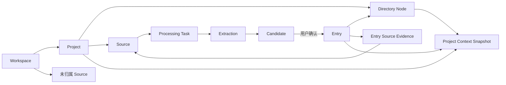

# 核心对象与关系

[返回产品蓝图索引](../产品蓝图.md)

> 权威范围：Workspace、Project、Source、Processing Task、Extraction、Candidate、Entry 与 Directory Node。

## 核心对象与关系



### Workspace

用户数据的隔离边界。任何项目、材料、候选、正式知识和 Agent 上下文都必须按 Workspace 隔离。

### Project

围绕一个相对独立目标建立的知识空间。

核心属性：

- 名称；
- 项目说明，可选；
- 生命周期状态；
- 正式目录；
- Source、Candidate 与 Entry；
- AI 项目理解。

生命周期：

```text
进行中 ↔ 暂停
   ↓       ↓
 已完成 ↔ 已归档
```

- 进行中：正常采集、整理和 Agent 任务。
- 暂停：保留浏览与搜索，减少主动提醒和后台发现。
- 已完成：目标已经结束，知识继续可读、可补充、可复用。
- 已归档：从默认项目列表隐藏，可从归档区恢复。

### Source

用户投入或确认保留的形成材料，是可追溯来源而不是知识本身。Source 证明“内容从哪里形成”，不代表材料客观正确或具有统一可信等级；截图、用户陈述、网页、其他 AI 输出和对话片段都可以成为真实来源，Grove 不因来源类型自动替用户裁定可靠性。

已锁定简单归属模型：

- Source 属于一个 Workspace；
- Source 可以暂未归属 Project，也可以属于一个 Project；
- 一条 Source 最多属于一个 Project；
- Source 下的 Candidate 和 Entry 不跨到其他 Project；
- 极少数跨项目材料由用户复制或重新采集处理，不为其增加核心模型复杂度。

首批类型：

- 图片或截图；
- 粘贴文字。

后续类型：网页、PDF、Word、音频、视频、经用户确认的对话片段等。对话片段 Source 应保留选定消息、模型信息、实际使用的 Grove Evidence 与用户编辑结果，使知识能够回到当时的形成上下文；可追溯不等于外部事实核验。

### Processing Task

一次可观察、可重试的处理任务。建议状态：

```text
等待处理 → 解析材料 → 提取候选 → 推荐归档 → 等待确认
                       ↘ 失败，可从失败步骤重试
```

重试不得复制 Source、Candidate 或已经确认的 Entry；旧结果不得被静默覆盖。

### Extraction

AI 对 Source 的一次版本化分析结果，用于记录：

- OCR 或文本解析结果；
- 语义拆分过程；
- Candidate 集合；
- 项目与目录推荐；
- 证据定位；
- 模型、提示与版本；
- 失败和重试信息。

Extraction 是运行与审计对象，不是正式知识。

### Candidate

等待用户判断的最小可用知识单元，是人工确认前的产品语义，不限定只能出现在桌面确认台。Candidate 可以来自 Source Extraction，也可以来自知识 Agent 在对话中准备的 Operation Draft；移动端 Operation Review 与桌面确认台都可以承担人的检查与确认。

一条 Source 可以产生多条 Candidate；每条 Candidate 可以被确认、修改后确认、拒绝、暂缓、合并到已有 Entry，或仅为已有 Entry 补充来源。用户已经在 Operation Review 中完整检查并确认时，该次确认可以直接形成正式 Entry，不应再强制进入第二次确认；若用户选择稍后处理，则进入 pending Candidate。

建议字段：

- 标题；
- 核心内容；
- 主类型建议；
- 适用条件，可选；
- 补充说明，可选；
- 信息性质；
- 证据片段或证据位置；
- 目录节点建议与备选；
- 与已有 Entry 的关系建议；
- 推荐理由与风险信号；
- 处理状态。

### Entry

用户确认后认为值得在个人知识库中保留的正式知识。正式状态表达用户决定与可追溯性，不表示 Grove 已将内容裁定为客观事实；有外部 Source 也不自动代表内容更可靠。

已锁定模型：

- Entry 必须属于一个 Project；
- Entry 有一个主目录节点；
- Entry 可以有多个标签；
- Entry 可以关联多个 Source 证据；
- Entry 的内容、类型和所属节点以后可以修改；
- 修改不得破坏来源关系，并保留基础版本记录；
- 节点改名或移动时，Entry 通过稳定 node_id 自然跟随。

统一结构：

```text
Entry
├── 标题
├── 核心内容
├── 主类型
├── 适用条件，可选
├── 补充说明，可选
├── 标签，可选
├── 主目录节点
├── 一个或多个来源证据
└── 基础修改记录
```

P0 不为不同类型建立专属数据模型，步骤、参数等先使用文本表达。

### Directory Node

用户组织项目知识的目录节点。节点包含稳定 ID、名称、说明、父节点与排序。

- 用户可以创建、改名、修改说明、移动、排序和删除节点；
- 空节点可以直接删除；
- 有 Entry 或子节点时必须先明确迁移或处理影响；
- AI 目录 Agent 的输出始终进入 Directory Draft；
- 节点说明既帮助用户理解目录，也为 AI 归类提供语义上下文。
