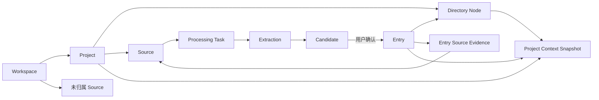

# 知林 Grove 产品蓝图与功能优先级

> 状态：产品决策基线 v1.0
> 更新日期：2026-08-13
> 用途：统一产品方向、功能边界与实施顺序；后续 OpenSpec change 应以本文为产品输入
> 说明：本文不是 OpenSpec 工件，不直接授权实施；与旧提案冲突时，以本文中的已锁定决策为准

## 1. 产品结论

### 1.1 一句话定义

Grove 是一个面向个人项目的 AI 知识共创工具：它把用户散落在截图、文字、网页和文档中的信息，整理成可确认、可追溯、符合个人理解方式的知识库，并逐步帮助用户发现知识缺口。

### 1.2 第一阶段的具体承诺

第一阶段不验证“所有人的第二大脑”，只验证一个明确承诺：

> 用户围绕一个具体项目投入一批截图或文字，Grove 能显著减少整理操作，把它们转化为用户愿意确认、之后能够找到并核对来源的结构化知识。

装修是首个真实验证场景，但底层对象和流程保持通用。旅行、育儿、健身、购买决策和专题学习等项目不依赖装修专属数据结构。

### 1.3 远期愿景

Grove 的长期目标是个人知识 Agent，但能力必须按可信度逐层建立：

```text
整理已有材料
    ↓
形成个人知识结构
    ↓
搜索、阅读与提问
    ↓
识别知识缺口
    ↓
经用户授权主动发现
```

第一阶段是“AI 辅助的项目知识整理器”，不是全能自治 Agent。

## 2. 用户与核心场景

### 2.1 首要用户

正在研究或推进一个复杂个人项目，已经收集大量材料，但没有时间和精力系统整理的人。

典型项目包括：

- 新房装修；
- 旅行规划；
- 育儿准备；
- 健身与健康管理；
- 汽车、家电等复杂购买决策；
- 学习一个专业主题；
- 个人职业规划。

### 2.2 用户真正雇佣 Grove 完成的任务

1. 先把材料扔进来，不要求立即分类和填表。
2. 让 AI 理解材料、拆出有用信息并推荐归属。
3. 用尽量少的操作确认、修改或拒绝 AI 候选。
4. 形成符合自己理解方式的目录和知识库。
5. 以后能按目录浏览、搜索、提问并核对原始来源。
6. 在知识积累后看见缺口，再决定是否让 AI 帮助研究。

## 3. 产品原则

### 3.1 信任原则

1. AI 生成的提取、归类、目录、修订、回答和发现结果都是候选。
2. AI 不得直接创建或覆盖正式 Entry。
3. 每条 Entry 必须能追溯到至少一条 Source 证据。
4. 用户的确认、拒绝、修改和纠正是闭环的一部分。

### 3.2 效率原则

1. 采集阶段少填信息，确认阶段才完成归类。
2. 项目和目录推荐直接预填，推荐正确时一次确认即可完成归档。
3. 支持快速模式与精细模式，不强迫所有候选都逐字段审查。
4. 高风险、冲突、证据不足的候选不能混入低风险批量确认。

### 3.3 结构原则

1. 目录是用户的个人心智模型，不是系统强塞的百科模板。
2. 新项目允许保持空目录，由用户手建或主动进入 AI 目录共创。
3. AI 可以建议新增、改名、移动或删除节点，但只能修改目录草稿。
4. 正式目录变更必须由用户明确确认。

### 3.4 克制原则

1. 先做好截图和文字，不以“支持所有媒介”为 MVP 目标。
2. 先做好整理和回忆，再做主动发现。
3. 不为展示 Agent 能力而增加无意义的自治流程。
4. 优先使用真实行为验证需求，再增加专属类型和复杂关系。

## 4. 核心对象与关系



### 4.1 Workspace

用户数据的隔离边界。任何项目、材料、候选、正式知识和 Agent 上下文都必须按 Workspace 隔离。

### 4.2 Project

围绕一个相对独立目标建立的知识空间。

核心属性：

- 名称；
- 项目说明，可选；
- 生命周期状态；
- 正式目录；
- Source、Candidate 与 Entry；
- AI 项目理解。

生命周期：

```text
进行中 ↔ 暂停
   ↓       ↓
 已完成 ↔ 已归档
```

- 进行中：正常采集、整理和 Agent 任务。
- 暂停：保留浏览与搜索，减少主动提醒和后台发现。
- 已完成：目标已经结束，知识继续可读、可补充、可复用。
- 已归档：从默认项目列表隐藏，可从归档区恢复。

### 4.3 Source

用户投入的原始材料，是证据而不是知识。

已锁定简单归属模型：

- Source 属于一个 Workspace；
- Source 可以暂未归属 Project，也可以属于一个 Project；
- 一条 Source 最多属于一个 Project；
- Source 下的 Candidate 和 Entry 不跨到其他 Project；
- 极少数跨项目材料由用户复制或重新采集处理，不为其增加核心模型复杂度。

首批类型：

- 图片或截图；
- 粘贴文字。

后续类型：网页、PDF、Word、音频、视频等。

### 4.4 Processing Task

一次可观察、可重试的处理任务。建议状态：

```text
等待处理 → 解析材料 → 提取候选 → 推荐归档 → 等待确认
                       ↘ 失败，可从失败步骤重试
```

重试不得复制 Source、Candidate 或已经确认的 Entry；旧结果不得被静默覆盖。

### 4.5 Extraction

AI 对 Source 的一次版本化分析结果，用于记录：

- OCR 或文本解析结果；
- 语义拆分过程；
- Candidate 集合；
- 项目与目录推荐；
- 证据定位；
- 模型、提示与版本；
- 失败和重试信息。

Extraction 是运行与审计对象，不是正式知识。

### 4.6 Candidate

等待用户判断的最小可用知识单元，是确认台的最小决策对象。

一条 Source 可以产生多条 Candidate；每条 Candidate 可以被确认、修改后确认、拒绝、暂缓、合并到已有 Entry，或仅为已有 Entry 补充来源。

建议字段：

- 标题；
- 核心内容；
- 主类型建议；
- 适用条件，可选；
- 补充说明，可选；
- 信息性质；
- 证据片段或证据位置；
- 目录节点建议与备选；
- 与已有 Entry 的关系建议；
- 推荐理由与风险信号；
- 处理状态。

### 4.7 Entry

用户确认后的正式知识。

已锁定模型：

- Entry 必须属于一个 Project；
- Entry 有一个主目录节点；
- Entry 可以有多个标签；
- Entry 可以关联多个 Source 证据；
- Entry 的内容、类型和所属节点以后可以修改；
- 修改不得破坏来源关系，并保留基础版本记录；
- 节点改名或移动时，Entry 通过稳定 node_id 自然跟随。

统一结构：

```text
Entry
├── 标题
├── 核心内容
├── 主类型
├── 适用条件，可选
├── 补充说明，可选
├── 标签，可选
├── 主目录节点
├── 一个或多个来源证据
└── 基础修改记录
```

P0 不为不同类型建立专属数据模型，步骤、参数等先使用文本表达。

### 4.8 Directory Node

用户组织项目知识的目录节点。节点包含稳定 ID、名称、说明、父节点与排序。

- 用户可以创建、改名、修改说明、移动、排序和删除节点；
- 空节点可以直接删除；
- 有 Entry 或子节点时必须先明确迁移或处理影响；
- AI 目录 Agent 的输出始终进入 Directory Draft；
- 节点说明既帮助用户理解目录，也为 AI 归类提供语义上下文。

### 4.9 Project Context Snapshot

供多个 Agent 共享的派生上下文，不是正式知识，也不覆盖用户说明。

建议结构：

```text
ProjectContext
├── user_description       用户项目说明，原文优先
├── project_summary        AI 项目概要
├── current_focus          当前关注方向
├── directory_topics       目录主题
├── knowledge_coverage     已确认知识覆盖
├── recent_topics          最近整理主题
├── lifecycle_status       生命周期状态
└── generated_at           更新时间
```

只使用正式目录和已确认 Entry 生成，不使用待确认 Candidate。目录或知识发生重要变化后异步、防抖更新；失败时继续使用上一份有效快照。用户可以查看、纠正和重新生成，纠正内容作为高优先级约束保留。

## 5. 候选生成与质量判断

### 5.1 两阶段处理

候选处理不能只问“一条还是两条”，而应分成两步：

```text
Source
  ↓
语义拆分：识别互相独立的陈述
  ↓
价值筛选：判断哪些值得进入主要确认流程
```

语义上不同的信息不能为了减少数量而强行合并；同时也不能把每个句子都拆成候选，造成确认数量爆炸。

拆分标准：一条候选脱离原文后仍能被独立理解和使用，并保留必要的对象、条件和语境。

### 5.2 推荐候选、其他发现与无效内容

```text
Source
├── 推荐候选：默认展开，进入确认队列
├── 其他发现：内容有效，但保存意图不明确，默认折叠
└── 无效内容：广告、寒暄、无法理解或明显无关，不进入常规界面
```

“事实、个人体验、建议、推测”只是信息性质，不是质量等级。旅行等场景中的个人体验可能具有很高决策价值。

### 5.3 推荐候选的判断维度

不要使用单一且虚假的“质量分数”。至少分别判断：

1. 采集意图匹配：备注、高亮、裁剪、当前项目和历史确认行为等。
2. 项目目标相关性：与项目说明、项目上下文和当前目录的关系。
3. 信息增量：新知识、补充、重复或无明显增量。
4. 独立可用性：脱离原文后是否仍完整、可理解、可行动。
5. 证据匹配：表述是否忠于原文，是否避免把个人体验泛化成事实。
6. 决策或行动价值：是否帮助选择、避险、操作、比较、规划或继续研究。

### 5.4 信息性质与轻类型

Candidate 和 Entry 使用一个主类型加多个标签。P0 主类型保持四种：

| 主类型 | 说明 | 示例 |
|---|---|---|
| 知识 | 事实、原理和经验结论 | 闭水试验通常至少持续 24 小时 |
| 方法 | 操作方法和步骤 | 闭水试验的执行步骤 |
| 参数 | 数值、尺寸、标准和条件 | 门洞预留尺寸 |
| 提醒 | 风险、避坑和注意事项 | 晶蕾烘干需要手动勾选 |

类型只影响图标、筛选和阅读组织，不改变 Entry 核心结构。AI 推荐类型，用户可以修改，确认时不强迫额外填写。

未解决的问题进入后续 Knowledge Gap，不伪装为正式知识；决策和待办也不作为 P0 Entry 类型。

## 6. 项目与目录推荐

项目与目录推荐是整理 Agent 的 P0 核心职责，不是后期增强。

### 6.1 项目推荐

- 从项目内部采集：直接使用当前 Project，不调用 AI 猜测。
- 从全局收集箱采集：AI 推荐一个 Project；不明确时保持未归属。
- 用户确认或修改 Source 的 Project 后，其 Candidate 继承该 Project。
- 修改 Source 项目后重新计算目录推荐。

### 6.2 目录推荐

每条 Candidate 独立推荐目录节点。推荐必须落到真实 node_id，而不是让模型自由输出无法匹配的路径。

推荐流程：

```text
Candidate
  ↓
应用检索真实目录节点与说明
  ↓
AI 在候选节点中选择主建议与备选
  ↓
返回 node_id、理由和风险信号
```

界面不展示虚假精确的百分比，可使用：

- 推荐明确；
- 需要确认；
- 暂无合适位置。

### 6.3 新增节点并归档

当没有合适节点时，允许用户一次确认“新增节点并归档”。

规则：

- AI 只能提出新节点建议；
- 用户明确确认后执行；
- 创建节点和归档 Entry 是原子操作，任何一步失败都不留下半成品；
- 多条 Candidate 推荐同一路径时合并成一条节点建议；
- 用户可以改为最接近节点或暂存未归档。

## 7. 候选确认台

确认决定始终落实到 Candidate，Source 只承担上下文和进度分组。

### 7.1 按采集审阅

默认精审视图，一次处理一条 Source 下的全部 Candidate：

```text
待处理 Source 列表 | 原始材料与证据 | 当前 Source 的候选
```

能力：

- 点击 Candidate 时高亮对应证据；
- 修改内容、类型、项目与目录；
- 确认、拒绝、暂缓、合并或补充已有知识；
- 在当前 Source 内多选并批量处理；
- 全部 Candidate 有明确结果后，Source 派生为“已处理”。

Source 状态建议：等待解析、解析中、待确认、部分确认、已处理、失败。

### 7.2 批量处理

跨 Source 的 Candidate 平铺或按推荐目录分组：

- 批量确认、拒绝和改目录；
- 按推荐目录、风险、来源和类型筛选；
- 点击 Candidate 展开 Source 和证据；
- 高风险、冲突、证据不足、可能重复的 Candidate 自动进入精审，不进入整组确认。

两个视图共享同一个 Candidate 池和处理状态，不存在“确认整个 Source 并自动采用所有候选”的语义。

### 7.3 快速模式与精细模式

- 快速模式：推荐准确时，用户一次确认内容、类型、项目与目录。
- 精细模式：展开证据、修改字段、处理重复或冲突后确认。

默认追求连续出现“推荐正确，确认下一条”的节奏；风险出现时再增加操作。

## 8. 归档前关系判断与后续 Review

Candidate 生成后、进入确认台前，整理 Agent 检索项目内已有 Entry 并给出关系建议：

```text
新知识       → 建议创建 Entry
疑似重复     → 建议为已有 Entry 补充 Source 证据
可以补充     → 建议生成 Entry 修订草稿
可能冲突     → 进入精审，由用户并列保留、修订或忽略
```

归档前关系判断只提供建议，最终动作由用户决定。

后续 Review 是第二层防线，定期检查历史知识中的重复、冲突、条件缺失、来源缺失和过期风险，不能代替归档前比对。

## 9. 目录共创

### 9.1 产品定位

新项目默认允许空目录，提供两个平等入口：

```text
手动创建第一个节点
与 AI 共创目录
```

目录共创应由独立的 Directory Agent 承担，而不是一次无状态的“生成目录”调用。

### 9.2 三类任务

1. 从零起草：根据项目说明和必要澄清生成候选目录。
2. 节点拓展：读取目标节点、现有子树、项目上下文与相关 Entry，提出更细结构。
3. 调整现有目录：根据自然语言提出新增、改名、移动、更新说明和建议删除。

### 9.3 统一工作流

```text
用户目标或对话
      ↓
Directory Agent
      ↓
可视化目录草稿
      ↓
结构差异：新增 / 改名 / 移动 / 建议删除
      ↓
用户确认
      ↓
正式目录
```

首次从零起草可返回完整候选树；后续调整优先返回结构化操作，避免完整重写导致节点漂移或丢失。

建议操作类型：AddNode、RenameNode、MoveNode、UpdateDescription、SuggestRemoveNode。

删除默认不选中，并显示受影响的子节点和 Entry 数量；正式变更由应用层校验并原子执行。

## 10. 知识使用方式

### 10.1 目录浏览

项目知识的主要入口。用户通过目录理解结构，并查看当前节点直接挂载的 Entry 或包含子树的 Entry。

### 10.2 卡片与列表

同一批 Entry 的两种视图，不是两种数据模型：

- 卡片：适合阅读、回顾和探索，突出核心内容、适用条件、类型和来源。
- 列表：适合扫描、筛选、排序和批量管理，突出标题、目录、类型、来源和更新时间。
- 系统记住项目内视图偏好；移动端默认卡片。

### 10.3 思维导图浏览

思维导图首先是目录浏览模式，不是编辑器：

- 图中默认只展示目录节点，不铺开全部 Entry；
- 节点分别显示直接 Entry 数和子树 Entry 数；
- 点击节点后在侧边面板查看直接知识，可切换包含子树；
- 支持展开、收起、聚焦子树和搜索高亮；
- 目录编辑、移动和删除仍在标准目录管理界面完成。

### 10.4 搜索

- P0：项目内和全局关键词搜索，覆盖标题、内容、目录和来源摘要。
- 后续：组合筛选、语义搜索、相似知识和搜索结果问答。
- 全局搜索可以跨项目找到 Entry，但不改变 Entry 的项目归属。

### 10.5 AI 阅读与提问

第一版定位为“带证据的知识阅读器”，不是依靠模型常识自由回答的聊天机器人。

支持范围：

- 节点阅读：当前节点及其子树；
- 项目阅读：整个项目。

规则：

1. 默认只读取已确认 Entry。
2. 关键结论附 Entry 与 Source 引用。
3. 显示冲突、适用条件和知识不足。
4. 知识库不足时明确说明，不用模型自身知识悄悄补齐。
5. 即时回答不是正式知识；保存回答内容时必须转为 Candidate 再确认。
6. 外部知识模式后置，并明确区分“仅我的知识库”和“知识库 + 外部发现”。

## 11. Agent 产品架构

产品不向用户强调多个 Agent，但技术职责应分离，不做一个全能 Agent。

| Agent | 核心职责 | 只读上下文 | 输出边界 |
|---|---|---|---|
| Organizing Agent | 解析、语义拆分、价值筛选、项目和目录推荐、关系判断 | Source、项目上下文、目录、已有 Entry | Extraction、Candidate 和归档建议 |
| Directory Agent | 起草、拓展和调整目录 | 项目上下文、目录、已确认 Entry、Source 摘要 | Directory Draft 与结构化操作 |
| Reader Agent | 节点或项目内阅读、总结和带引用问答 | 已确认 Entry 与 Source 证据 | 即时答案或待确认 Candidate |
| Discovery Agent | 识别缺口、经授权研究外部来源 | 项目上下文、目录、已确认 Entry | 新 Source、Candidate 和发现报告 |

### 11.1 PydanticAI 的角色

Grove 同时是 PydanticAI 的学习与实践项目，但产品需求决定技术使用方式：

- 用 Pydantic 模型定义 Agent 依赖、工具参数和结构化输出；
- Agent 负责理解、推理、工具选择和生成草稿；
- 普通应用服务负责权限、持久化、事务、幂等和正式数据校验；
- Agent 工具默认只读正式数据，写入目标是 Candidate 或 Draft；
- 确认正式 Entry 或 Directory 的动作由应用服务在用户操作后执行；
- 不为了“像 Agent”引入自主循环、多 Agent 协商或后台无限任务。

### 11.2 公共上下文

多个 Agent 共享 Project Context Snapshot，避免各自对项目作出相互矛盾的总结。用户项目说明始终具有最高优先级，AI 项目理解可以自动刷新但必须可见、可纠正。

## 12. 技术与工程基线

本节只记录跨 change 的长期技术决策。具体实现方案、数据迁移和取舍仍应记录在对应 OpenSpec change 的 `design.md` 中。

### 12.1 已锁定技术栈

| 层 | 决定 | 边界 |
|---|---|---|
| Web 前端 | React 19 + TypeScript + Vite + Tailwind 4 + shadcn/ui + TanStack Query | 桌面优先，所有核心流程保证 390px 移动宽度可用 |
| 后端 | Python ≥3.12 + FastAPI + Pydantic v2 + async SQLAlchemy 2 + Alembic | API、权限、事务和正式数据校验由普通应用服务负责 |
| 数据库 | 开发与测试 SQLite，生产 MySQL 8 | 所有业务数据从第一行代码起按 Workspace 隔离 |
| Agent 框架 | PydanticAI + Grove Agent 服务层 | 用于结构化依赖、工具调用和输出；不得绕过人工确认边界 |
| 模型接入 | Grove `AIProvider` 抽象 + 兼容供应商客户端 | 保留 DeepSeek、豆包和后续供应商切换能力；Demo Provider 支持离线确定性测试 |
| 配置 | pydantic-settings + 环境变量 | 密钥只放本地 `.env`，仓库只提交 `.env.example` 占位键 |
| 工程流程 | Git + OpenSpec | 每个功能 change 独立提案、验证、归档和提交；推送与合并需用户确认 |

### 12.2 AI 与模型策略

- 当前阶段使用云端模型 API，不建设本地模型模式。
- 文本 Agent 与视觉解析解耦：DeepSeek 等文本模型不具备所需视觉能力时，使用独立多模态 Provider 处理截图。
- 不提前锁定 OCR 或视觉供应商；P0 使用 30 至 50 张真实中文截图评测长图、水印、表格、低清晰度和证据定位后决定。
- 复杂规划和目录共创可使用能力更强的模型，批量抽取、分类和摘要可使用成本较低的模型；具体分层必须通过真实质量与成本数据确定。
- Pydantic 模型定义 Agent 输入、依赖、工具参数和结构化输出；结构校验失败允许有界重试，不允许无限自主循环。
- Agent 只生成 Extraction、Candidate、Draft 或即时回答；正式 Entry 和正式目录仍由应用服务在用户确认后写入。

### 12.3 基础设施演进

| 能力 | 初始方案 | 演进条件 |
|---|---|---|
| 任务管道 | 进程内异步 Worker + 数据库状态机 | 并发量、可靠性或多实例部署出现真实瓶颈后再引入独立队列 |
| 附件存储 | 本地文件系统 | 云部署或多实例前迁移到对象存储，并保持存储接口可替换 |
| 搜索 | 数据库关键词检索 | P1 语义检索 change 再引入向量索引，不在 P0 提前建设 |
| 认证 | 账号 + 密码 + 会话 Cookie | 推广期再评估邮箱、手机号、第三方登录和密码找回 |
| 部署 | 本机开发 | 云端目标可采用 ECS + Nginx，但在部署 change 中重新确认 |
| 移动端 | 390px 响应式 Web | P3 根据采集频率和系统分享需求评估 React Native Expo 原生客户端 |
| 对话 UI | 先使用 Grove 自有页面与组件 | Reader Agent 开工前再 spike CopilotKit 等方案，不提前锁定依赖 |

### 12.4 开放技术决策

- OCR / 多模态 Provider 的质量、成本、限流与隐私条款；
- PydanticAI 与现有 `AIProvider` 的适配边界和版本策略；
- Project Context、目录检索和 Entry 检索的上下文预算；
- 云端部署、附件对象存储与备份方案；
- 语义检索的向量模型、索引位置和 MySQL 兼容方案；
- Reader Agent 对话 UI 是否需要引入 CopilotKit；
- 视频与音频未来是处理原文件，还是只接收字幕和转写文本。

这些决策必须在对应 change 开工前通过 spike 或真实数据评测锁定，不在产品蓝图中假设已经完成。

## 13. 信息架构与关键页面

### 13.1 全局层

```text
项目
收集箱
搜索
账户
```

- 项目：项目列表、状态筛选和创建入口。
- 收集箱：全局采集、未归属 Source、处理状态和待确认入口。
- 搜索：跨项目查找已确认 Entry。
- 账户：个人设置、AI Provider 与数据管理，后续逐步补齐。

### 13.2 项目层

```text
项目首页
知识空间
确认台
采集与来源
AI 阅读
```

- 项目首页：下一步任务、最近知识、处理进度和项目理解，不做装饰性数据看板。
- 知识空间：目录、卡片、列表和后续思维导图。
- 确认台：按采集审阅与批量处理。
- 采集与来源：项目内采集、Source 列表、处理状态、失败重试和来源详情。
- AI 阅读：节点或项目范围的带引用问答。

## 14. 功能清单与优先级

优先级定义：

- P0-A：可信整理闭环，没有它无法验证产品价值。
- P0-B：整理效率闭环，没有它可能技术可用但用户会被确认成本劝退。
- P1：形成 Grove 的目录共创与回忆差异化。
- P2：提高知识质量、媒介覆盖和通用性。
- P3：主动发现与平台化。

### 14.1 已有基础能力

当前仓库已经具备或已归档规格覆盖：

- 账号注册、登录、退出和会话；
- 默认个人 Workspace 与隔离；
- 项目创建、列表、重命名和删除；
- 多级目录节点创建、编辑、删除和排序；
- 前后端工程基础、AI Provider 抽象与 Demo Provider。

注意：当前“创建项目时选择 149 节点装修模板”的实现与本蓝图冲突，后续应改为默认空目录，并保留手建或 AI 共创入口。

### 14.2 P0-A：可信整理闭环

- [ ] 项目说明可选字段；项目生命周期增加进行中、暂停、已完成、已归档。
- [ ] 默认空目录创建，移除装修模板作为产品默认路径。
- [ ] 图片批量上传、图片粘贴和文字粘贴采集。
- [ ] Source、Attachment、Processing Task 与版本化 Extraction。
- [ ] OCR 或多模态解析 Provider 评测与接入。
- [ ] Project Context Snapshot 初始版本：基于项目说明与正式目录生成，支持异步更新、失败回退、展示和纠正。
- [ ] Organizing Agent 基于 PydanticAI 输出结构化 Candidate。
- [ ] 语义拆分、推荐候选、其他发现和证据定位。
- [ ] 按 Source 审阅，逐条确认、编辑、拒绝和暂缓。
- [ ] 当前 Source 内多选确认或拒绝。
- [ ] 确认后创建 Entry，并保留 Candidate 与 Source 证据关系。
- [ ] Entry 卡片与列表两种视图。
- [ ] 按目录浏览，区分节点直接知识与子树知识。
- [ ] Entry 详情、来源查看、后续编辑和移动目录节点。
- [ ] 项目内与全局关键词搜索。
- [ ] Processing Task 进度、失败原因和幂等重试。
- [ ] 390px 移动宽度支持采集、查看状态和基础确认。

### 14.3 P0-B：整理效率闭环

- [ ] 全局收集箱中 AI 推荐 Source 所属项目。
- [ ] 每条 Candidate 推荐真实目录 node_id、备选和理由。
- [ ] 推荐明确、需要确认、暂无合适位置三档路由状态。
- [ ] 确认 Candidate 时一次接受内容、类型、项目和目录。
- [ ] 新增节点并归档的原子操作。
- [ ] 跨 Source 批量处理视图。
- [ ] 按推荐目录分组确认、批量改目录和批量拒绝。
- [ ] 高风险 Candidate 自动退出批量快审。
- [ ] 与已有 Entry 的基本相似检索。
- [ ] 新建、疑似重复、补充、可能冲突的归档建议。
- [ ] 重复时只为已有 Entry 补充新 Source 证据。
- [ ] Project Context Snapshot 增强：纳入已确认 Entry、知识覆盖和近期主题，并记录上下文版本。
- [ ] 记录用户接受、修改和拒绝推荐的行为，为后续个性化提供信号。

P0-A 与 P0-B 都完成后才视为 MVP 验证版本。实施时分开做小 change，避免一次交付过大。

### 14.4 P1：目录共创与知识回忆

- [ ] Directory Agent 从零起草目录并进行必要澄清。
- [ ] 可视化 Directory Draft、内联编辑和确认应用。
- [ ] 与 AI 对话调整草稿，使用结构化增量操作。
- [ ] 对任意节点进行 AI 拓展。
- [ ] 对现有目录提出新增、改名、移动、更新说明和建议删除。
- [ ] 目录差异展示、受影响 Entry 数量与安全合并。
- [ ] 语义搜索和相似知识推荐。
- [ ] Reader Agent 节点范围与项目范围问答。
- [ ] 回答引用 Entry 和 Source，知识不足与冲突可见。
- [ ] 回答内容转 Candidate 的确认流程。
- [ ] 思维导图目录浏览、聚焦、高亮和节点知识侧栏。
- [ ] Entry 基础版本历史与 AI 修订建议。

### 14.5 P2：知识质量与媒介扩展

- [ ] 网页链接采集与正文提取。
- [ ] PDF、Word 等文档解析。
- [ ] 浏览器扩展和移动端系统分享入口。
- [ ] Review：重复、冲突、缺少条件、缺少来源和过期风险。
- [ ] 组合筛选、标签管理和更完整的批量管理。
- [ ] 多 Source 证据比较与来源可信度辅助判断。
- [ ] Knowledge Gap 对象和用户维护的待研究问题。
- [ ] 目录与知识覆盖分析。
- [ ] 跨项目引用或复制知识的受控能力。
- [ ] 数据导入、导出与彻底删除。

### 14.6 P3：主动发现与平台化

- [ ] Discovery Agent 识别目录和知识缺口。
- [ ] 用户批准研究问题、范围、信源和频率。
- [ ] 联网搜索、来源质量判断和多来源比较。
- [ ] 发现结果先创建 Source，再生成 Candidate。
- [ ] 发现报告、定期检查和知识变化提醒。
- [ ] “仅我的知识库”与“知识库 + 外部发现”双模式。
- [ ] 视频和音频处理评估。
- [ ] 原生移动 App、截图直采和发现报告推送。
- [ ] 多 Workspace、多人协作和复杂权限，仅在真实需求出现后评估。

## 15. 明确不做或暂缓

以下内容不进入 P0：

- 视频和音频理解；
- 各平台收藏自动同步；
- 通用知识图谱；
- 多 Agent 自主协商；
- 无需授权的后台主动研究；
- 自动写入或覆盖正式 Entry；
- 自动修改正式目录；
- 决策、预算和待办等垂直对象；
- 多人协作和社区分享；
- 每种 Entry 类型的专属结构；
- 原生移动客户端；
- 149 节点装修模板作为默认创建方式。

## 16. 验证计划与指标

### 16.1 真实数据集

首轮使用 50 至 100 条真实装修截图和文字，覆盖：

- 单条与多条知识；
- 事实、个人体验、建议和推测；
- 有明确采集意图与无备注采集；
- 多候选归入不同节点；
- 重复、补充和冲突；
- OCR 困难、长图、水印和低质量截图。

旅行场景补充一小组以验证系统不会把主观体验错误降级为低价值。

### 16.2 核心指标

- Source 到第一条 Candidate 的时间；
- 每条 Source 产生的推荐候选数与其他发现数；
- Candidate 直接确认率；
- 用户修改率及主要修改字段；
- 项目推荐接受率；
- 目录推荐接受率和错误节点率；
- 单条和单批确认耗时；
- 每条 Source 最终产生的有效 Entry 数；
- 放弃确认的 Source 和 Candidate 比例；
- 处理失败率与重试成功率；
- 一周后通过目录或搜索重新找到知识的比例；
- Entry 来源查看和知识实际使用情况。

### 16.3 MVP 成功判断

必须同时回答两个问题：

1. 用户是否愿意确认 AI 生成和推荐归类的内容？
2. 用户整理完成后是否会回来查找、阅读或使用这些知识？

只提高提取数量、模型调用次数或上传数量，不代表产品成立。

## 17. 隐私、删除与可观察性

P0 就需要明确：

- 哪些 Source 内容会发送给第三方 AI Provider；
- OCR 文本、附件和模型输出的保存方式；
- 删除 Source 时对 Candidate、Entry 和证据关系的影响；
- 删除 Project 时的二次确认和级联范围；
- Agent 使用的模型、任务状态、失败原因和重试结果；
- AI 项目理解、推荐理由和来源证据对用户可见；
- 正式数据与可重新生成的派生数据明确区分。

删除含正式 Entry 唯一证据的 Source 时不得静默造成无来源 Entry，必须阻止删除或让用户先明确处理关联 Entry。

## 18. 建议的 OpenSpec Change 顺序

每个 change 都应小到可以独立验证，禁止直接创建一个覆盖全部 P0 的巨大 change。

### 18.1 产品基线修正

1. `revise-project-lifecycle-and-empty-start`
   - 项目说明；
   - 生命周期；
   - 默认空目录；
   - 归档与恢复；
   - 修正旧装修模板默认路径。

### 18.2 P0-A 整理闭环

2. `add-source-and-attachment-foundation`
   - Source、Attachment；
   - 图片与文字采集；
   - Workspace 和 Project 归属；
   - Source 列表与详情。

3. `add-processing-task-pipeline`
   - 状态机、异步处理、失败重试和幂等；
   - Demo 与真实 Provider 边界。

4. `add-project-context-snapshot`
   - 基于项目说明和正式目录的初始概要；
   - 更新触发、防抖、失败回退、展示和纠正；
   - Agent 公共上下文接口。

5. `add-organizing-agent-extraction`
   - PydanticAI 接入；
   - OCR 文本输入；
   - 语义拆分、候选筛选和证据定位；
   - Extraction 与 Candidate。

6. `add-source-review-workbench`
   - 按 Source 审阅；
   - Candidate 编辑、确认、拒绝、暂缓；
   - Source 派生处理状态。

7. `add-entry-and-provenance`
   - Entry、主类型、目录归档；
   - 多 Source 证据；
   - 来源详情和基础修改。

8. `add-knowledge-browse-and-search`
   - 目录下卡片与列表；
   - 直接知识与子树知识；
   - 项目内和全局关键词搜索。

### 18.3 P0-B 效率闭环

9. `add-project-and-node-routing-suggestions`
   - 全局 Source 项目推荐；
   - Candidate 真实 node_id 推荐；
   - 推荐状态与一次确认。

10. `add-create-node-and-archive`
   - 新节点建议去重；
   - 新增节点并归档原子操作；
   - 无合适节点的处理分支。

11. `add-batch-candidate-review`
    - 跨 Source 批量视图；
    - 按节点分组、批量操作与精审分流。

12. `add-entry-relation-suggestions`
    - 相似 Entry 检索；
    - 新建、重复、补充与冲突建议；
    - 补充来源和修订草稿。

13. `enhance-project-context-with-entries`
    - 将已确认 Entry、知识覆盖和近期主题纳入上下文；
    - 保存上下文版本和更新原因；
    - 为归类、关系判断和后续 Agent 提供稳定快照。

### 18.4 P1 差异化能力

14. `add-directory-agent-drafting`
15. `add-directory-agent-node-expansion`
16. `add-semantic-retrieval`
17. `add-reader-agent-with-citations`
18. `add-directory-mind-map-view`

每个 change 必须完整执行：proposal → specs → design → tasks → validate → 实施 → sync specs → archive → commit。推送与合并仍需用户明确确认。

## 19. 已锁定产品决策

1. 产品远期是个人知识 Agent，第一阶段是 AI 辅助的项目知识整理器。
2. 装修是首个验证场景，但不建立装修专属核心模型。
3. 新项目默认可为空目录，不自动生成小骨架，不以大型模板作为默认入口。
4. 用户可以手建目录，也可以主动使用 AI 目录共创。
5. Directory Agent 是独立专业 Agent，只操作草稿。
6. Candidate 是最小确认单位，确认台可按 Source 或 Candidate 两种方式组织。
7. P0 先做按 Source 审阅，MVP 效率阶段补跨 Source 批量处理。
8. Source 最多属于一个 Project；其 Candidate 不跨项目。
9. 每条 Candidate 独立推荐真实目录 node_id。
10. 项目与目录推荐属于 P0 核心能力，正确时一次确认完成归档。
11. 支持“新增节点并归档”的明确原子操作。
12. Candidate 先做语义拆分，再做价值筛选；不把事实与个人体验当作质量高低。
13. 推荐候选、其他发现和无效内容分层，减少确认负担而不丢失有效信息。
14. Entry 使用统一结构，一个主类型、一个主目录节点、多个标签和多个 Source 证据。
15. 主类型先固定为知识、方法、参数、提醒，不建立类型专属表。
16. Entry 可修改、可移动目录，保留来源和基础版本。
17. 归档前判断新知识、重复、补充和冲突；历史 Review 作为第二层防线。
18. 知识空间支持目录、卡片、列表，后续增加思维导图浏览。
19. AI 阅读支持节点和项目范围，只基于已确认知识并附引用。
20. 项目说明可选；AI 使用正式目录和已确认 Entry 自动维护可见、可纠正的项目理解。
21. 项目生命周期为进行中、暂停、已完成和已归档。
22. PydanticAI 用于结构化 Agent、工具和依赖管理，不把自治程度作为产品目标。
23. 主动发现必须在整理、回忆和信任闭环成立后实施，外部结果仍先成为 Source 和 Candidate。

## 20. 仍需通过真实使用验证的问题

以下问题不阻塞蓝图，但不能靠讨论永久定死：

- 一条 Source 的理想推荐候选数量；
- “其他发现”的默认折叠策略是否会漏掉用户真正想保存的内容；
- 四种主类型是否足够，用户是否真的使用类型筛选；
- 目录推荐需要节点说明到什么程度才能稳定；
- 批量确认的安全阈值与高风险分流规则；
- Entry 补充与新建之间最容易理解的交互；
- 项目上下文快照的更新频率和用户纠正方式；
- 卡片、列表、思维导图和 AI 阅读的真实使用占比；
- 何时具备进入主动发现阶段的证据。

这些问题应通过真实数据集、交互日志和用户实际使用逐步回答，不应提前扩张数据模型。

## 21. 后续实现代理使用说明

将本文交给 DeepSeek、Codex 或其他实现代理时，应同时提供仓库内 `AGENTS.md`，并使用以下约束：

1. 本文是产品决策输入，不是一次性实施任务。
2. 每次只选择第 18 节中的一个 change，不得同时展开后续 change。
3. 先读取当前主规格与代码现状，再创建完整 proposal、specs、design、tasks。
4. `openspec validate --all --strict` 通过后才允许修改业务代码。
5. change 的 Non-Goals 必须明确列出同阶段尚未选择的其他能力。
6. 不得因为底层模型预留了字段，就提前实现 P1、P2 或 P3 界面与流程。
7. 每个 change 完成后独立运行后端、前端与 OpenSpec 验证，再归档和提交。
8. 推送和合并必须等用户真实体验并明确确认。

建议每次给实现代理的任务模板：

```text
请先阅读 AGENTS.md、docs/产品蓝图与功能优先级.md、当前 openspec/specs 与相关代码。
本次只处理蓝图第 18 节的 <change-name>，不要实施后续 change。
严格执行 proposal → specs → design → tasks；运行 openspec validate --all --strict
通过后再开始实施。遇到蓝图未锁定的产品分歧，先记录并询问，不要静默扩展范围。
实现完成后验证、归档并本地提交；不要 push 或 merge。
```
