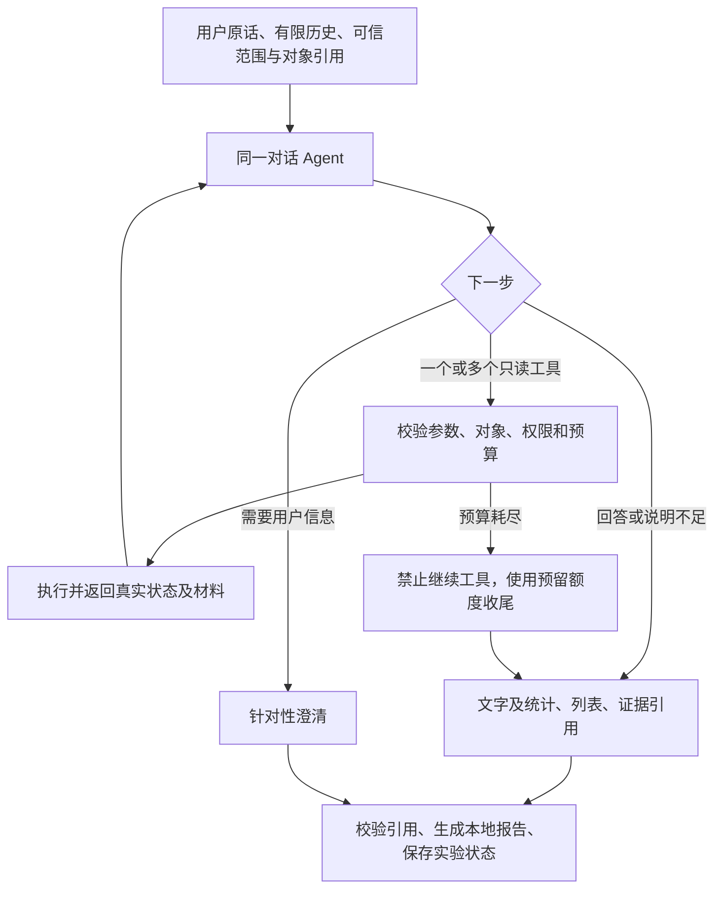

## Context

本实验验证只读对话的组织方式，不重做整个知识 Agent。基础分支已有真实领域工具、模型配置和多轮评测器，但也存在已知预算语义及工作集缺陷。正式 API、Worker 与主规格继续适用；实验不据此宣称生产兼容、原生验收或基础 change 已完成。

## Goals / Non-Goals

**Goals：** 在同一数据和模型条件下，比较统一对话循环与现有流程的整段任务完成情况、证据使用及资源消耗；在有限样本内得出“值得正式接入／不支持继续／证据不足”的可审阅结论。

**Non-Goals：** 沿用 proposal 中列出的范围外事项。实验不迁移现有任务池，不写入真实会话或知识，不构建新页面，不引入新框架，不修复所有旧流程缺陷。

## Decisions

### 1. 项目内实验包，隔离运行两条路径

建议入口为 `python -m evals.dialogue_loop`，提供无模型检查、固定对照和本地交互三种模式；真实模型模式必须显式启用，默认只预检。实现代码集中在 `backend/evals/dialogue_loop/`，不被正式 API/Worker 导入。

通过 SQLite backup 读取开发库一致快照，两条路径各使用独立临时副本。子进程必须在导入应用数据库和配置模块前绑定副本数据库；启动时核验实际连接路径不等于原库，并禁用自动 Worker、提取与后台写任务。对话运行可写副本的消息、Run、Evidence 与审计，业务表仍不允许变更。原始附件路径只读使用，运行前后检查材料指纹。

身份验证复用应用认证逻辑，使用既有 demo 账号；密码隐藏输入，不写命令参数、文件或报告。身份、Workspace 成员关系和界面范围从服务端验证结果取得，不能从模型或测试预期取得。Provider 继续通过应用配置读取，不把 API key 复制进脚本或输出。临时副本可能含敏感配置，因此目录权限 700、文件 600，退出清理副本；异常退出后的残留只在下一次运行时清理本实验自有目录。

旧路径在隔离进程中复用既有创建 Run、领取和 `execute_run` 调用链，按当前代码正常持久化；新路径使用实验会话与每轮审计 Run，排除正常领取流程，按相同领域工具合同执行。不启动额外 Web 服务，不伪造旧路径的模型结果。两臂按固定场景轮换先后顺序，避免总是同一臂先运行。

选择数据副本而非直接写现有 demo 对话，是为了不污染 App 历史，并让两臂获得相同业务数据；不另做演示数据。旧路径仍可能因已知工作集缺陷失败，必须原样报告。实验绕开旧工作集生命周期，只能证明求解效果，不能证明该缺陷已修复。

### 2. 一个持续工具对话，不增加前置分类模型

继续用项目已安装的 Pydantic AI，工具和输出通过 Pydantic 定义。一次模型响应可提出多个独立只读调用；同一 Agent 的后续请求携带必要的公开对话与工具消息，不要求隐藏推理，也不另加覆盖检查模型。

每组不超过四轮。第二版保留每轮用户原话和已展示回答；历史工具结果转成程序生成的结构化摘要，保留工具名、实际查询条件、状态、完整性、必要统计、列表句柄、标题和准确顺序。大段 Entry 正文与 Source 原文只保存在程序侧结果仓，后续需要时由当前轮工具重新读取。摘要不依赖模型，不承担任务分类或事实改写。

模型历史必须保持 Pydantic AI 的请求、工具调用和工具返回配对协议。压缩发生在结构化消息部件层，不截断序列化后的字符串，也不留下孤立工具消息。历史句柄只用于定位程序侧材料；对象、正文和来源仍在当前轮重新执行权限、发现集合和 Evidence 核验。

每次模型请求派发前，程序对完整待发送消息（包括本轮刚返回的工具材料）做长度估算。估算值与 Provider 返回的真实 token usage 分开记录；估算只是保守门禁，不宣称精确保证 Provider 上限。达到资料阶段软阈值后禁止继续取资料，并使用已预留的一次文本请求在输入预算内组织回答；收尾仍计入每轮和整批文本请求总额。若压缩后连收尾输入也无法容纳，则不再调用模型，明确返回预算限制。

第二版真实评测发现，Pydantic AI 2.30.0 在传入非空 `message_history` 时不会自动补入静态
`system_prompt`，使续聊和独立收尾缺少完整 Grove 规则。修复采用框架的 `instructions` 入口：当前
`SYSTEM_PROMPT` 在每次 Agent run 和该 run 内的结构化重试中作为当前 instructions 传递；重建历史时
删除所有旧 `SystemPromptPart`，而不把规则复制进历史。收尾指令只作为当前完整规则之外的追加约束。
无模型测试直接检查 FunctionModel 收到的 messages 和 instructions，覆盖首轮、续聊、纠正和独立收尾，
并确认没有重复或旧规则。用户原话、工具配对、列表顺序、权限和本轮 Evidence 规则保持不变。

模型失败记录分为 `schema_validation`、`reference_validation`、`truncated`、`budget`、`provider` 和
`unknown`。每次文本调用只保存可公开的文本响应、结构化工具名和参数、finish reason，以及有界异常链；
明确排除 ThinkingPart、Provider 隐藏元数据、密码和密钥。输出校验器在抛出 `ModelRetry` 前记录具体
句柄错误；schema 失败从已保存的最终输出工具参数中离线复验。收尾仍不增加重试，公开失败回答仍只
展示程序已验证材料。

旧估算把 Pydantic AI 内部 dataclass、未发送元数据和请求参数整体序列化。第二版真实报告的 48 个
已派发请求中，估算／实际输入比为 1.418 至 2.504，总估算 280773、实际 137708，整体为 2.039；
被拦截请求没有 usage，真实长度继续未知。修复改为构造 OpenAI 兼容 Provider 形状的投影：只包含当前
instructions、实际消息角色与内容、可见工具及输出工具 schema，再按 UTF-8 字节和显式固定开销估算。
投影组件、估算版本、请求来源和实际 usage 逐调用记录，已派发请求另计算误差；新循环主 Agent、共享
工具内部模型和旧链路模型分别标记。它仍不是 DeepSeek tokenizer，不把单批校准外推为精确上限，
9000 软阈值、12000 硬上限和总调用预算保持不变。

### 3. 权限、查询条件和对象分开

可信 owner/Workspace/界面项目范围始终通过 `RunToolContext` 注入。查询项目是该范围内的筛选条件，使用经程序解析的项目引用；不能将模型给出的项目当作授权依据。

工具请求携带本次完整筛选条件，项目字段必填，使用明确的“授权范围全部”或合法项目引用；不以省略字段隐式继承全局 `current_project_id`。程序记录每次已执行条件及其对应用户消息供下轮模型参考。用户限制的继承、替换和清除由原话与历史辅助模型判断，并通过固定对照检查，不新增一个模型专门判断条件。

列表以 `result_set_handle + position` 引用，程序映射实际展示顺序，验证属于本实验会话及当前范围。跨轮对象重新读取，旧文本或旧 Evidence 只作线索，不直接当成本轮事实。实验的范围验证遵守现有只读工具规格；权限错误使用本地反例测试验证。

### 4. 复用领域工具，适配结果语义

白名单覆盖授权项目枚举／解析、语义搜索、结构化筛选排序、精确总数、分组统计、Entry 正文与来源读取、列表位置解析。项目枚举直接使用受成员关系约束的服务端查询；其余复用 `read_tools.py`、`read_tool_adapters.py`、`structured_query_tools.py` 与 `tools.py`，不暴露任意 SQL 或写工具。

实验适配层把原有聚合能力暴露为两个明确入口：总数工具只接受范围与筛选并返回可信总数；分组统计工具另接受合法分组维度并返回桶。模型不再同时填写 `operation` 与 `group_by`。适配器继续调用同一个共享底层统计实现，不复制或改变领域算法；参数错误必须指出具体字段和值为何无效。

记录类型筛选为可选参数，省略或空列表表示全部正式记录；只有用户明确说出 knowledge、method、parameter 或 reminder 等内部类型限制时才传相应筛选。工具说明必须区分用户泛称“知识库记录／知识”和内部 `knowledge` 类型，不能依靠原题关键词、固定条数或固定 ID 特判。所有结果记录实际执行的类型、项目及权限范围条件。

搜索返回候选并不自动证明结论；正文读取遵守发现集合约束；来源由现有核验逻辑产生当前 Run Evidence。适配器在工具入口检查预算，不用调用零额度搜索来模拟无匹配；未知执行状态不能推断为完整。

统一返回 `status`（ok/empty/partial/not_executed/error/denied）、`completeness`、实际筛选条件、结果引用和错误原因。原始领域状态保留在审计里；适配不能把真实错误改成成功。语义 top-k 或截断的零匹配只能说明本次未匹配，精确总数仅来自完整确定性集合聚合。

如果复用工具本身存在无法由边界适配解决的缺陷，先记录阻断点并停止相关验证；修复共享实现将改变实验范围和对照基线，必须另行明确，不复制一份偷偷修好的领域算法冒充同工具对照。

### 5. 混合结果使用有序块，不提前选通道

实验输出包含有序文字块、统计引用块、列表引用块、Evidence 引用及不足说明。模型只提供合法句柄，程序从工具结果填入数字、列表和原文。Markdown 报告按块顺序渲染，不改正式响应 schema 或客户端组件。

最终结果引用必须归属当前轮；跨轮列表对象可用历史句柄定位，但需要当前轮复验、读取后形成新的依据。模型自造引用、复制旧 Evidence 或试图改写工具数字时，不得输出为有效结果；最多一次结构化纠正，仍失败则明确输出失败及已验证材料。没有外部工具时，不把模型通用知识标为实时外部资料。

程序只保证对象、来源与结构化事实边界，不声称验证了自然语言真伪。漏答、引用是否支持结论和表达自然程度在报告中逐项人工审阅，不由 Agent 自评分数决定。

### 6. 首批预算与停止条件

以下为提案建议上限，获批实施后写入两臂共享的冻结预算清单；不是当前已经发生的调用或费用承诺。

| 层级 | 首批上限 |
|---|---|
| 固定对照 | 三组 × 四轮 × 两臂 = 最多 24 条用户消息，只跑一批，不自动重复 |
| 每轮模型请求 | 文本最多 12 次（含路由、重排、纠正和收尾），向量最多 4 次；所有内部调用与重试纳入计数 |
| 新循环工具动作 | 最多 8 次，单批并发最多 2；检索每次至多 10 条候选，每轮最多读取 30 个不同 Entry、20 个 Evidence |
| 旧流程工具预算 | 保持现有内部规则并冻结记录，同时受相同全局模型与耗时上限限制；工具粒度不同，不宣称每个工具动作一一等价 |
| 每轮时间 | 求解最多 120 秒，另预留最多 15 秒和一次文本请求收尾；收尾计入 12 次上限 |
| 整批请求 | 文本最多 192 次、向量最多 64 次，达到任一上限停止，不补跑缺失轮次 |

每次模型调用还需固定输入与输出长度上限，并在预检打印实际配置；任何内部调用若无法计入预算或无法受超时约束，真实评测不得启动。请求计数在派发前预留，向量、重排、框架重试均不能绕过；并发调用各用独立 AsyncSession 与局部可变上下文，已发现集合合并与审计顺序由程序管理，不共享可变数据库会话。

第二版保持第一版模型、每请求输入上限 12,000 token、输出上限和表中请求总额，便于比较修订效果。输入长度采用与模型协议相容的确定性估算并设置低于 12,000 的资料软阈值，至少预留一次收尾请求所需空间；具体估算阈值在预检和报告中冻结。真实 usage 仍只采用 Provider／框架返回值，不能由估算替代。本轮修复不启动新的真实评测。

待批准的第二版真实套件包含原 A-C 三组和 D-E 两组表达变体，共五组 × 四轮 × 两臂、最多 40 条用户消息。每轮上限及整批文本 192、向量 64 的硬上限保持不变；增加消息数不增加模型请求总额，达到整批上限即停止剩余轮次。默认 `base` 套件仍为 24 条，只有显式选择 `v2` 才包含变体。

真实评测前必须再执行零模型全链路彩排：使用同一 demo 认证、快照、两臂子进程顺序和 24 条固定消息，
但以明确标记的本地代表值走完逐轮检查点、异常签名、资源汇总、脱敏和最终报告。代表值覆盖实际 usage 中可出现的
`Decimal`、集合和元组；彩排模型请求必须为 0。彩排只是付费前的基础设施门禁，不用作语义、共享工具或旧流程效果证据。

上述调用上限不能换算成已知金额。记录实际 token；usage 不可得时标明未知，不能报告零费用。若有可信费率才估算金额，报告区分估算与实际账单。不得通过换模型、放宽上限或新增批次继续试到成功。

权限或业务数据完整性失败时停止整批；单轮模型/工具失败记录真实终态。固定的完整后续问题可以继续，依赖未产生列表的追问标记 blocked，不编造对象。相同基础设施异常第二次发生后停止整批。取消应结束本实验子进程并清理；不实现进程崩溃后自动续跑，重启默认不能再次触发付费调用。

### 7. 固定对照与评价

模型不接收预期答案。预期由副本的独立只读 SQL 和实际来源内容生成，不复用被测统计函数；项目名称和排序对象在运行前解析，不硬编码 ID 或条数。业务数据、材料、模型配置（不含密钥）、代码、提示词与用例摘要在报告中冻结。

| 组 | 固定四轮输入 | 主要检查 |
|---|---|---|
| A：统计和范围 | “我现在知识库里一共多少条知识” → “分项目汇总给我” → “其中房子装修项目有多少条” → “回到全部项目，分别统计数量” | 总数、所有项目含零条桶、切换和清除条件；泛称知识覆盖全部正式类型 |
| B：混合问答 | “甲醛是什么，我知识库里有说甲醛哪里来的，以及怎么除甲醛吗” → “环保等级呢” → “我的知识库里关于这些等级有哪些记录” → “只根据我的知识库总结这些等级，没有的就说没找到” | 三项需求、自然追问、真实记录和 Evidence、用户依据限制；不对标准内容作额外医学或法律结论 |
| C：列表与话题 | “列出房子装修项目最近更新的五条知识” → “第三条展开说说” → “先不查知识库，聊聊怎样记笔记更容易复习” → “回到刚才那个五条列表，第三条的来源是什么” | 实际展示顺序、对象身份、不查库限制、新话题后恢复特定列表、本轮来源复验 |

没有所需项目或材料时预检给出不满足的前提，不能临时改题挑选容易通过的样本。范围外、无匹配、预算不足、工具故障与模型格式错误先使用不调用真实模型的本地注入测试覆盖，不增加第四组付费对话。

每轮报告实际文字和有序结果块、筛选条件、工具与模型摘要、原始错误原因、usage、耗时及停止原因。整段评价分为 pass/fail/review/blocked；自动边界通过但语义未人工核对的段落保持 review。完整保存旧流程失败，不把“旧流程数据库失败、新流程没用该数据库机制”单独作为架构胜出的证据。

第二版评分必须核对精确总数是否被明确展示，不能用分类桶相加恰好正确代替；分组结果同时核对项目名与数量对应关系；列表核对完整准确顺序；每组另给出整段对话是否完成任务的判定。变体只用于下一批冻结清单，覆盖换项目、明确类型限制和话题切换后的对象引用，且不会写入 Agent 提示词或用于实施阶段调参。

只有新路径三组确定性边界全部通过、语义审阅通过，且在两臂均完成的可比轮次呈现具体改善、没有新增退化，才支持提出正式接入方案。成本与耗时逐项展示，超限或可比数据不足时给出“证据不足”。结果相当但成本下降可作为继续研究依据，不宣称已证明质量提升。单批不提供总体成功率承诺。

报告写入 Git 忽略的 `data/knowledge-agent-evals/dialogue-loop/<batch>/`，目录 700、文件 600，不存密钥、密码或隐藏推理；只保存有界可审阅材料。脱敏验收摘要可另写进受版本控制的验收记录。

## Risks / Trade-offs

- 自主选择仍可能漏答或错误继承 → 固定多轮核对、保留真实失败；不靠继续增加在线分类器消除所有语义不确定性。
- 两臂内部编排和工具动作粒度不同 → 同数据、模型和全局资源边界，单独记录内部限额与适配差异，避免声称完全等价。
- 旧流程已知缺陷影响比较 → 无模型预检定位；隔离失败与语义质量，不用失败直接证明新循环更优。
- 复用工具包含审计写入 → 只允许临时副本写审计，正式业务表哈希前后核对，默认不连接原库执行 Run。
- 实验不覆盖生产生命周期 → 不改 App、不归档基础 change；正式接入前另行明确持久化、恢复、界面与迁移范围。

## Migration Plan

第一版报告与结论原样保留。第二版先修订规划工件并严格校验，再实现实验适配、无模型测试与零模型全链路彩排，以独立版本标识输出新报告。完成后提交下一批的冻结评测清单；真实评测只在另行确认后启动。实验完成无论效果好坏都报告证据，等待用户审阅后按 AGENTS.md 收尾，不自动推送、合并或归档。

有效代码后续选择性迁入基础开发分支，不将本实验分支直接作为正式版本发布。删除或停用实验入口即可停止实验，不需要生产数据回滚。

## Open Questions

第二版规则注入、诊断记录和输入估算修复及无模型验证已获批准；本轮不启动真实评测。保持既有模型、9000 token 资料软阈值与 12,000 token 输入硬上限，不用调高上限掩盖估算问题。由于历史报告没有保存完整请求表示，新估算相对真实 token 的误差仍需最小真实诊断确认。C 组首轮类型误解发生时完整规则已经存在，本轮不得宣称解决该语义问题。长期历史压缩、正式状态迁移和 UI 块协议属于后续正式改造。
